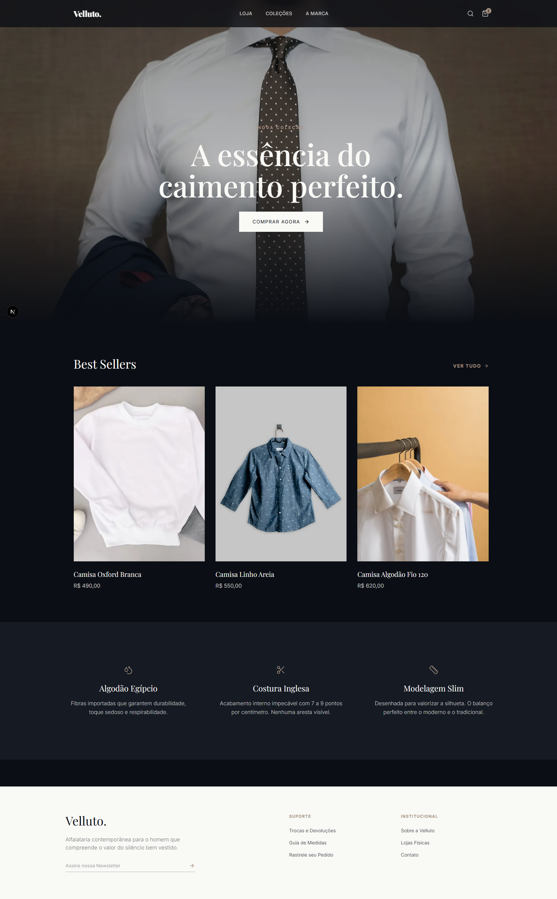
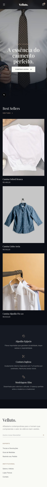

# Velluto. | Alfaiataria Premium E-commerce

Uma simulação de e-commerce high-end focada em alfaiataria clássica. O objetivo deste projeto foi construir uma experiência de "Quiet Luxury" (luxo silencioso) focada em performance, tipografia fluida e interações suaves, fugindo do design engessado de lojas virtuais padrão.

<div align="center">
  <table>
    <tr>
      <td align="center"><b>Desktop View</b></td>
      <td align="center"><b>Mobile View</b></td>
    </tr>
    <tr>
      <td>
        
      </td>
      <td>
        
      </td>
    </tr>
  </table>
</div>

## 🛠 Tech Stack

O projeto foi construído utilizando as ferramentas mais recentes do ecossistema React:

* **Framework:** Next.js (App Router)
* **Linguagem:** TypeScript
* **Estilização:** Tailwind CSS v4 (com variáveis CSS inline e design system customizado)
* **Animações:** Framer Motion
* **Ícones:** Lucide React

## ✨ Destaques de Arquitetura e UX

Este não é apenas um layout estático. Várias decisões técnicas foram tomadas para simular um ambiente de produção real:

* **Filosofia Mobile First:** A responsividade não foi feita apenas com *media queries*, mas adaptando a UX. Exemplo: A barra de filtros no catálogo (`/shop`) usa um scroll horizontal nativo (`snap-x`) no mobile, evitando dropdowns desajeitados, e muda para uma lista limpa no desktop.
* **Animações de Layout (Framer Motion):** Uso intenso de `AnimatePresence` para menus expansíveis e barras de busca, garantindo que os componentes entrem e saiam do DOM sem "piscar" na tela.
* **Gerenciamento de Estado do Carrinho:** Lógica completa de carrinho de compras no front-end (adição, remoção, alteração de quantidade e cálculo automático de frete/subtotal) utilizando hooks do React.
* **Roteamento Dinâmico:** Implementação de rotas dinâmicas (`/product/[id]`) simulando o consumo de uma API para renderizar páginas de detalhes de produtos de forma escalável.
* **Otimização de Imagens:** Uso extensivo do componente `<Image>` do Next.js para garantir carregamento preguiçoso (lazy loading) e redimensionamento automático, com configuração de `remotePatterns` para domínios externos.

## 🚀 Como rodar localmente

Clone o projeto e instale as dependências:

```bash
git clone [https://github.com/seu-usuario/camisaria-landing-page.git](https://github.com/seu-usuario/camisaria-landing-page.git)
cd camisaria-landing-page
npm install